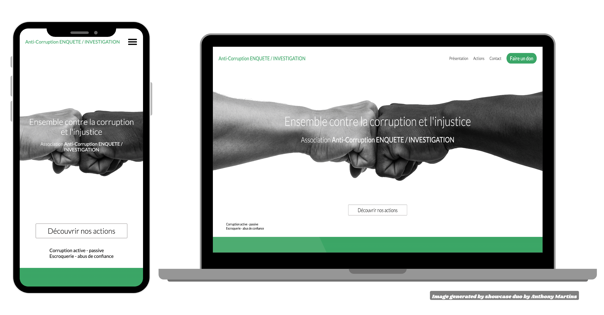

# Landing page - Association Anti-Corruption ENQUETE / INVESTIGATION

## Aperçu du projet

## Description du projet

Réalisation de la landing page pour l'association Anti-Corruption ENQUETE / INVESTIGATION.  
Ce projet a été développé avec React.js et SCSS, sans back-end, et utilise l'API Formspree pour la gestion du formulaire de contact, intégrant également reCAPTCHA pour sécuriser les envois. 
J'ai également assuré le référencement du site sur les moteurs de recherche et sa mise en ligne.

## Démo en ligne

Vous pouvez consulter la landing page en ligne ici : [Anti-Corruption ENQUETTE / INVESTIGATION](https://anti-corruption-enquete-investigation.org/)

## Objectifs

- Utilisation de  pour créer une interface dynamique et réactive.
- Optimisation du  à l'aide de  pour une meilleure organisation et maintenabilité du code.
- **Référencement** : Optimisation du SEO pour améliorer la visibilité du site sur les moteurs de recheche.
- **Mise en ligne** : Hébergement et publication de la landing page en ligne.

## Fonctionnalités

- 
 : Interface entièrement responsive pour une expérience optimale sur mobile, tablette et desktop.
- Formulaire de contact sécurisé avec reCAPTCHA, géré par l'API Formspree.

## Auteur

  
